## Other Key Decisions

### No Celery*
Celery is intentionally avoided. It provides poor batching support, no control over model lifecycle, and inefficient GPU usage. This project uses long-lived custom workers with explicit batching and manual polling strategies instead.

Celery treats every task as independent and stateless, which means it spins up a worker context per task. For GPU workloads that's catastrophic — model load times can be seconds. Your system uses long-lived workers that keep models warm between tasks and control exactly when a model is loaded or swapped. Celery gives you no hooks for that lifecycle.

### Postgres Mock, Not SQLite
The homelab event bus mock is backed by Postgres (not SQLite) because Postgres supports `LISTEN`/`NOTIFY` — genuine push semantics that mirror Kafka's consumer model. This avoids the polling loops that SQLite requires and fits cleanly with the existing Postgres deployment. Zero extra infrastructure for homelab use.


### Redpanda over Raw Kafka
Redpanda is Kafka-compatible but operationally lighter — no JVM, no ZooKeeper. It's the right call for a project that needs real Kafka semantics without a full Kafka cluster.


## Naming Conventions:

## Event Log (Kafka/Redpanda) Topics

Use dot-separated **noun.verb** (past tense — things that *happened*):

```
post.synced
post.chunked
post.embedded
post.analysed

chunk.created
chunk.embedded

search_job.created
search_job.completed

embedding.completed
search_query.embedded
inference.completed
```

**Pattern:** `{entity}.{past_tense_verb}`

---

```

post.synced -> chunk.post_body + chunk.post_summary + inference.categorise_post
post.embedded
post.analysed -> chunk.post_analysis + embed.{model} (for each analysis result)

chunk.created -> embed.{model}

search_job.created -> embed.{model} (for the search query)
search_query.embedded -> search.run
search_job.completed

embedding.completed  (chunk embeddings — terminal, no downstream task)
inference.completed

```

## RabbitMQ Exchanges

All exchanges are `direct`. Routing key == queue name — explicit, debuggable, no wildcard matching needed.

| Exchange    | Type   | Purpose                                         |
|-------------|--------|------------------------------------------------|
| `ingestion` | direct | CPU tasks: post chunking and pre-processing     |
| `embedding` | direct | GPU tasks: text embedding, routed by model      |
| `inference` | direct | GPU local + IO API inference tasks              |
| `search`    | direct | CPU tasks: search execution and ranking         |
| `dlx`       | direct | Dead-letter sink for all rejected/expired tasks |

**Pattern:** `{concern}` → routes to `{worker_type}.{task}.{qualifier}` queues

---

## RabbitMQ Queues and Bindings

**Queue pattern:** `{worker_type}.{task}.{qualifier}`  
**DLQ pattern:** `dlq.{worker_type}.{task}.{qualifier}`

| Exchange    | Queue                         |
|-------------|-------------------------------|
| `ingestion` | `cpu.chunk.post`              |
| `embedding` | `gpu.embed.bge-base-v1.5`     |
| `embedding` | `gpu.embed.qwen3-0.6b`        |
| `inference` | `gpu.infer_local.qwen3.5-4b`  |
| `inference` | `io.infer_api.chatgpt-4o`     |
| `search`    | `cpu.search.run`              |
| `search`    | `cpu.search.rank`             |
| `dlx`       | `dlq.{queue_name}`            |

Each work queue carries `x-dead-letter-exchange: dlx` and `x-dead-letter-routing-key: dlq.{queue_name}`, so failed messages route automatically to the corresponding DLQ.

The `gpu.embed.{model}` queue-per-model design directly serves the warm-model constraint — workers bind to their model's queue and only swap when it drains.

> **Note on routing keys:** The routing key is intentionally identical to the queue name. Publishers use the destination queue name as the key — this is explicit, self-documenting, and removes ambiguity when debugging message flow.


# Architecture

A detailed breakdown of the system architecture, component responsibilities, event flow, and RabbitMQ topology.

For term definitions see [Glossary.md](./Glossary.md).

---

## Two-Layer Design

The system is built around a deliberate separation between two layers that solve different problems:

```
┌─────────────────────────────────────────────────────┐
│  EVENT LOG (Redpanda/Kafka)                         │
│  Immutable, replayable, ordered. Source of truth.   │
│  "What happened"                                     │
└─────────────────────┬───────────────────────────────┘
                      │ consumers derive work from events
┌─────────────────────▼───────────────────────────────┐
│  TASK QUEUE (RabbitMQ)                               │
│  Mutable, ack-based, routed to worker pools.         │
│  "What needs to be done"                             │
└─────────────────────────────────────────────────────┘
```

These layers are not redundant. The Event Log is the audit trail and integration backbone — durable, replayable, consumer-agnostic. RabbitMQ is the work distribution mechanism — it handles routing, retries, priorities, and backpressure. Each does what it is best suited for.

---

## Component Roles

| Component | One-line responsibility |
|---|---|
| **Producer** | Writes events to the Event Log. Knows nothing about consumers. |
| **Event** | An immutable fact. Past tense. No destination. |
| **Consumer** | Reads from the Event Log. Could be a dispatcher, analytics service, audit logger, etc. |
| **Dispatcher** | A consumer that translates events into tasks and publishes to RabbitMQ. The only component aware of both layers. |
| **Exchange** | RabbitMQ routing mechanism. Routes messages to queues by routing key pattern. Not a queue itself. |
| **Queue** | Where tasks wait for workers. Durable, DLQ-backed. |
| **Task** | A unit of work. Imperative, present tense, has a specific destination. |
| **Worker** | Consumes from a RabbitMQ queue. Does actual work. Knows nothing about the Event Log. |

---

## Full Pipeline Map

```
┌─────────────────────────────────────────────────────────────────────┐
│ PRODUCERS (write events to Redpanda)                                │
│                                                                     │
│  API / sync service         → post.synced                           │
│  ChunkWorker (after done)   → chunk.completed                       │
│  EmbedWorker (chunk done)   → embedding.completed                   │
│  EmbedWorker (query done)   → search_query.embedded                 │
│  SearchAPI                  → search_job.created                    │
└────────────────────────────┬────────────────────────────────────────┘
                             │
┌────────────────────────────▼────────────────────────────────────────┐
│ REDPANDA TOPICS (event log)                                         │
│                                                                     │
│  post.synced          → { post_id, has_summary, source }            │
│  chunk.completed      → { post_id, chunk_ids, chunk_type, chunk_table }                      │
│  embedding.completed    → { post_id, chunk_ids }                    │
│  search_query.embedded  → { query_job_id, model_name }              │
│  search_job.created     → { job_id, query, filters }                │
└────────────────────────────┬────────────────────────────────────────┘
                             │
┌────────────────────────────▼────────────────────────────────────────┐
│ DISPATCHERS (Redpanda consumers → RabbitMQ publishers)              │
│                                                                     │
│  PostDispatcher                                                     │
│  EmbeddingDispatcher                                                │
└────────────────────────────┬────────────────────────────────────────┘
                             │
┌────────────────────────────▼────────────────────────────────────────┐
│ RABBITMQ EXCHANGES + QUEUES (topic exchanges)                       │
└────────────────────────────┬────────────────────────────────────────┘
                             │
┌────────────────────────────▼────────────────────────────────────────┐
│ WORKERS                                                             │
│                                                                     │
│  CPU                                        
└─────────────────────────────────────────────────────────────────────┘
```

## GPU Worker Design

GPU workers are long-lived to avoid model reload cost. Key constraints:

- **Prefetch count = 1** — a GPU worker only accepts one task at a time. It will not pull a second message until the first is fully processed and acknowledged. This prevents queue saturation from slow workers.
- **Model warm strategy** — workers keep the loaded model in memory between tasks. A model is only unloaded when either a different model is required or the queue is empty.
- **Queue ordering** — GPU workers poll queues in a defined priority order (e.g. query embeddings before batch chunk embeddings) to ensure latency-sensitive tasks are not starved by bulk work.
- **Batching** — where a queue accumulates multiple tasks, workers process them in explicit batches to maximise GPU throughput.

---

## Infrastructure Abstraction

All event bus interaction is behind an interface, allowing the implementation to be swapped without touching any consumer or producer logic:

```
EventBusBase
  ├── RedpandaEventBus    (production)
  └── PostgresEventBus    (homelab / integration tests)
```

The active implementation is selected via an environment variable. No consumer or producer knows which is in use.

### Why Postgres, not SQLite, for the mock

The Postgres mock is preferred over SQLite because Postgres supports `LISTEN`/`NOTIFY`, which provides genuine push-based consumption — consumers block on a notification rather than polling in a loop. This is a meaningful semantic match to Kafka's consumer model. SQLite requires polling loops, which waste resources and add latency.

Since Postgres is already required for the application database, the mock adds zero additional infrastructure for homelab use.

---

## RabbitMQ Topology Patterns

**Topic exchanges** are used throughout. This gives routing flexibility — binding patterns like `post.chunk.*` can match any routing key under that prefix — without requiring topology changes when new task types are added.

**Dead letter exchange (DLX)** — every queue is configured with a dead letter exchange. Messages that fail repeated processing or are explicitly rejected land in the DLQ rather than being silently dropped. DLQ depth is a monitored metric.

**Durable queues and messages** — all queues and messages are durable. Tasks survive a RabbitMQ restart.

---

## Database Layer

| Concern       | Repo         | Notes                           |
| ------------- | ------------ | ------------------------------- |
| Post metadata | `post_repo`  | Title, source, URL, sync status |
| Chunks        | `chunk_repo` | Text, post ID, chunk index      |
|               |              |                                 |
| Search jobs   | `job_repo`   | Query, status, result reference |

Postgres is used for all persistence. pgvector provides the ANN (approximate nearest neighbour) search capability used in the search pipeline.


# Full Pipeline Map

```mermaid

flowchart TD

    %% ─── FLOW 1: SYNC & INGEST ───────────────────────────────────

    subgraph PRODUCER["📤 Producer"]
        API["API / Sync Service"]
    end

    subgraph EL1["📋 Event Log · Kafka / Redpanda / Postgres mock · (immutable, replayable)"]
        E1(["post.synced"])
        E4(["search_job.created"])
    end

    note1["PostSyncedEvent ─────────────────\npost_id: int\npost_table: str\nfields_changed: list[str]  ← [] means first sync\nhas_summary: bool\nupdated_at: datetime"]

    subgraph DISP1["🔀 PostDispatcher · bridge layer"]
        D1{"Route on\nfields_changed"}
        D1a["Publish: chunk.body task"]
        D1b["Publish: chunk.summary"]
        D1c["Publish: inference.analysis"]
    end

    subgraph TQ1["⚙️ Task Queue · RabbitMQ · ingestion + inference exchanges"]
        T1["ChunkTask  kind=chunk\ntask_type=body\npost_id · post_table · embed_model"]
        T2["ChunkTask  kind=chunk\ntask_type=summary_title\npost_id · post_table · embed_model"]
        T3["InferTask  kind=infer\ntask_type=categorise"]
        T5["EmbedTask  kind=embed\ntask_type=query\njob_id · query_text · embed_model"]
    end

    note2["ChunkTask\n─────────────────\ntask_id: uuid\nkind: 'chunk'\ntask_type: body | summary_title | analysis\npost_id: int\npost_table: str\nembed_model: str\ntrace_id: str | None\nsource_event_id: str | None"]

    subgraph CPU_WK1["🖥️ CPU Workers · long-lived processes · consume from queue"]
        W1["chunk_body()\nsplits + cleans body\nwrites chunks to chunk_table"]
        W2["chunk_summary_title()\nsplits title + summary\nwrites chunks to chunk_table"]
    end

    subgraph GPU_WK1["⚡ GPU Workers · long-lived processes · model warm"]
        W3["run_inference()\nmodel warm · writes analysis result"]
        W5["embed_query()\nsingle vector · model warm · prefetch=1"]
    end

    subgraph TH1["🎯 Task Handlers · deserialise · validate · dispatch to worker fn"]
        H1["ChunkBodyHandler\nparses ChunkTask\ncalls chunk_body(post_id, post_table)\nacks on success · rejects to DLQ on error"]
        H2["ChunkSummaryHandler\nparses ChunkTask\ncalls chunk_summary_title(post_id)\nacks on success · rejects to DLQ on error"]
        H3["CategoriseHandler\nparses InferTask\ncalls run_inference(post_id, model)\nacks on success · rejects to DLQ on error"]
        H5["EmbedQueryHandler\nparses EmbedTask (task_type=query)\ncalls embed_query(query_text, model)\nacks on success · rejects to DLQ on error"]
    end

    subgraph EL2["📋 Event Log"]
        E2(["chunk.created"])
        E5(["search_query.embedded"])
    end

    note3["ChunksCreatedEvent\n─────────────────\npost_id: int\npost_table: str\nchunk_ids: List[str]\nchunk_table: str\nchunk_count: int\ncreated_at: datetime"]

    subgraph DISP2["🔀 EmbeddingDispatcher"]
        D2["Publish: gpu.embed task\nper chunk_table / model"]
    end

    subgraph TQ2["⚙️ Task Queue · RabbitMQ · embedding exchange"]
        T4["EmbedTask  kind=embed\ngpu.embed.{model}\nchunk_ids · chunk_table · embed_model"]
        T6["SearchTask  kind=search\ncpu.search.run\njob_id · query_vector · filters"]
    end

    subgraph WK2["🖥️ Worker · GPU · long-lived · consume from queue"]
        W4["embed_chunks()\nGPU · batch embeds\nmodel warm · prefetch=1\nwrites vectors to chunk_table"]
    end

    subgraph TH2["🎯 Task Handler"]
        H4["EmbedHandler\nparses EmbedTask\nbatches chunk_ids\ncalls embed_chunks(batch, model)\nacks on success · rejects to DLQ on error"]
        H6["SearchHandler\nparses SearchTask\ncalls run_search(job_id, vector, filters)\nacks on success · rejects to DLQ on error"]
    end

    subgraph EL3["📋 Event Log"]
        E3(["embedding.completed"])
    end

    note4["EmbeddingCompletedEvent\n─────────────────\npost_id: int\npost_table: str\nchunk_ids: List[str]\nchunk_table: str\nmodel_name: str"]

    DB[("Postgres + pgvector\nchunks.{type}.{model}")]

    API -->|"emit event"| E1
    E1 -.->|schema| note1
    E1 --> D1
    D1 -->|"body or custom_body in fields_changed\nOR fields_changed is empty"| D1a
    D1 -->|"has_summary=True AND\ntitle or summary in fields_changed\nOR fields_changed is empty"| D1b
    D1 --> D1c
    D1a --> T1
    D1b --> T2
    D1c --> T3
    T1 -.->|schema| note2
    T1 --> W1
    T2 --> W2
    T3 --> W3
    T5 --> W5
    W1 --> H1
    W2 --> H2
    W3 --> H3
    W5 --> H5
    H1 -->|"emit chunk.created"| E2
    H2 -->|"emit chunk.created"| E2
    H3 -->|"emit chunk.created"| E2
    E2 -.->|schema| note3
    E2 --> D2
    D2 --> T4
    T4 --> W4
    W4 --> H4
    H4 -->|"emit embedding.completed"| E3
    E3 -.->|schema| note4
    H4 --> DB

    %% ─── FLOW 2: SEARCH ──────────────────────────────────────────

    subgraph PROD2["📤 Producer"]
        API2["Search API\nsaves search_job to Postgres"]
    end

    subgraph DISP3["🔀 SearchDispatcher"]
        D3["Publish: embed query task\ngpu.embed.{model}"]
    end

    subgraph DISP4["🔀 SearchDispatcher"]
        D4["Publish: cpu.search.run task"]
    end

    subgraph WK4["🖥️ Workers · CPU · long-lived · consume from queue"]
        W6["run_search()\nCPU · ANN search on pgvector\naggregates + ranks results\nwrites to search_jobs table"]
    end


    RESULTS[("search_jobs table\nresults written to Postgres")]

    API2 -->|"emit search_job.created"| E4
    E4 --> D3
    D3 --> T5
    E5 --> D4
    D4 --> T6
    T6 --> W6
    W6 --> H6
    H5 -->|"emit search_query.embedded"| E5
    H6 --> RESULTS

    %% ─── STYLES ──────────────────────────────────────────────────

    classDef eventLog    fill:#FAEEDA,stroke:#BA7517,color:#633806
    classDef dispatcher  fill:#EEEDFE,stroke:#534AB7,color:#3C3489
    classDef taskQueue   fill:#E1F5EE,stroke:#0F6E56,color:#085041
    classDef handler     fill:#FBEAF0,stroke:#993556,color:#72243E
    classDef worker      fill:#F1EFE8,stroke:#5F5E5A,color:#444441
    classDef db          fill:#E6F1FB,stroke:#185FA5,color:#0C447C
    classDef producer    fill:#F1EFE8,stroke:#5F5E5A,color:#444441
    classDef schema      fill:#F1EFE8,stroke:#B4B2A9,color:#5F5E5A,font-size:11px

    class E1,E2,E3,E4,E5 eventLog
    class D1,D1a,D1b,D1c,D2,D3,D4 dispatcher
    class T1,T2,T3,T4,T5,T6 taskQueue
    class H1,H2,H3,H4,H5,H6 handler
    class W1,W2,W3,W4,W5,W6 worker
    class DB,RESULTS db
    class API,API2 producer
    class note1,note2,note3,note4 schema
```

